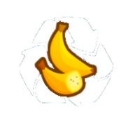

<h1 align="center">

SalvageIt
</h1>

A mod that helps you load another player's map save or send yours to others, preserving the exact setup for a perfect salvage :)

Drag the salvage file into the right folder which you can open by goint to the mod settings and clicking the "Open Folder" button. 
To save a salvage, just click the "Save Salvage" button In-Game, and it will be saved right away.

Important note: you must start the game on the exact same game mode and map for it to work perfectly.

This mod was mainly created because of ISAB; I really enjoyed his salvage videos, but watching him struggle to set up each salvage inspired me to create this mod to help. I also hope it will lead to more salvages per video :D

